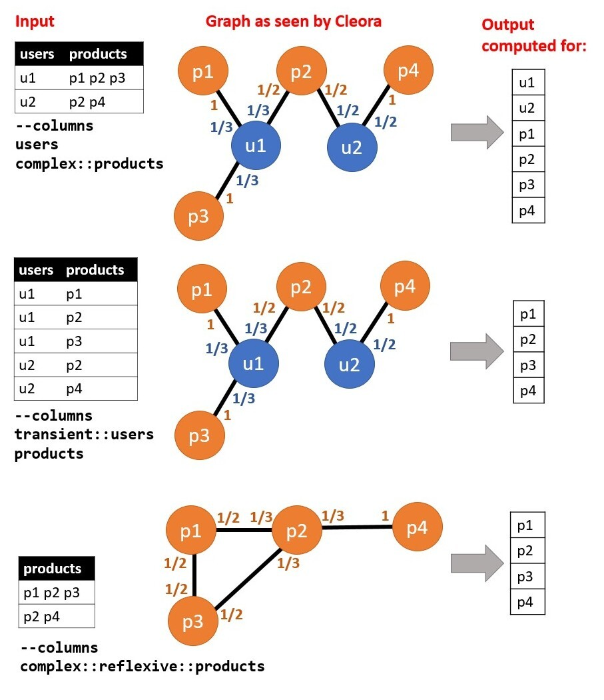

.. _running:

Running
========== 

This page details how to use the cleora run command to define the embedding resources at runtime.

Run parameters 
--------------

input (--input or -i)
********************************************************
A parameter that defines path for input file. You can use also absolute path or relative path.
     

file type (--type or -t)
********************************************************
This parameter is responsible for defining the input file extension to the algorithm. Cleora supports two kinds of input files **.tsv**(tab-separated values) and **.json**.

dimension (*--dimenstion* or *-d*)
********************************************************
Embedding dimension size.

number of iterations (*--number-of-iterations* or *-n*)
********************************************************
Max number of iterations.

columns (*--columns* or *-c*)
********************************************************
Column names (max. 12), with modifiers from list: [transient::, reflexive::, complex::]

.. list-table::
   :widths: 20 80
   :header-rows: 1

   * - Modifiers
     - Description
   * - transient
     - The field is virtual - it is considered during embedding process, no entity is written for the column
   * - reflexive   
     - The field is composite, containing multiple entity identifiers separated by space in TSV or an array in JSON
   * - complex  
     - The field is reflexive, which means that it interacts with itself, additional output file is written for every such field
   * - ignore
     - The field is ignored, no output file is written for the field

Allowed combinations of modifiers are:  
    - `transient`
    - `complex`
    - `transient::complex`
    - `reflexive::complex`

For TSV datasets containing composite fields (categorical array), multiple items within a field are then separated by space.

The specification of an input format is as follows:

    .. code-block:: none

        --columns="[column modifiers, ::]<column_name> [column modifiers, ::]<column_name> [column modifiers, ::]<column_name> ..."

Combinations which don't make sense are:

.. list-table::
   :widths: 40 80
   :header-rows: 1

   * - Modifiers
     - Description
   * - reflexive
     - This would represent an identity relation
   * - transient::reflexive   
     - This would generate no output
   * - reflexive::transient::complex
     - This would generate no output

Picture below representation how works column modifiers:

relation name (*--relation-name* or *-r*)
********************************************************
Name of the relation, for output filename generation.

prepend field name (*--prepend-field-name* or *-p*)
********************************************************
Prameter that responsible for prepending field name to entity in output.

log every n (*--log-every-n* or *-l*)
********************************************************
Set log output for every N lines

in memory embedding calculation (*--in-memory-embedding-calculation* or *-e*)
*********************************************************************************
Parameter that responsible for using calculate embeddings in memory or with memory-mapped files. Default is on (setting -e 0). If you want off use -e 1.

output dir (*--output-dir* or *-o*)
********************************************************
Set output directory for files with embeddings.

output format (*--output-format* or *-o*)
********************************************************
A parameter that defines the format of the output file. Possible output format are textfile (.txt) and numpy (.npy)

Examples Cleora run configuration
---------------------------------
.. code-block:: bash

   ./cleora -i files/samples/edgelist_sample.tsv 
            --columns="complex::reflexive::a b complex::c" 
            -d 128 
            -n 5 
            --relation-name=test_realation_name
            -p 0

